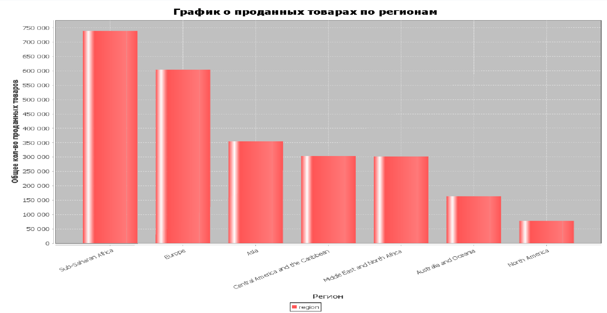
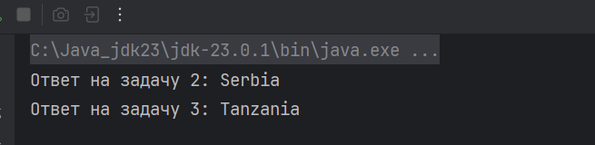

Проект по Java по теме "Продажа продуктов в мире"

Ход работы:\
1 Создаем класс Sale\
2 Создаем Parser, который распарсит переданный csv файл\
3 Создаем DbHandler для создания и управления БД, отправки sql запросов\
4 Создаем Graph, который создает и выводит диаграмму(по убыванию для удобства)

1 задание - диаграмма(по убыванию для удобства)

2 и 3 задание - запросы для поиска страны по условиям

